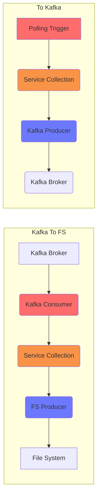

# Kafka Testing

Project tests interlok-kafka features

## What it does

This project is very simple and contains two channels with one workflow each.

The first workflow has a polling trigger that produces a message every 10 seconds and publish it to a Kfka topic.

The second workflow is listening on the topic and copy the message on the file system.




## Getting started

Before starting Interlok you need to create a Kafka docker container with

* `docker-compose up`

Then start Interlok

* `./gradlew clean build`
* `(cd ./build/distribution && java -jar lib/interlok-boot.jar)`

The config is using a variables.properties to configure the Kafka host, topics and the file system directory.

```
kafkaHost=localhost
kafkaPort=9092
kafkaServer=${kafkaHost}:${kafkaPort}
kafkaGroup=interlok_kafka
kafkaTopic=destTopic
fsDir=file://localhost/./messages/in
```
